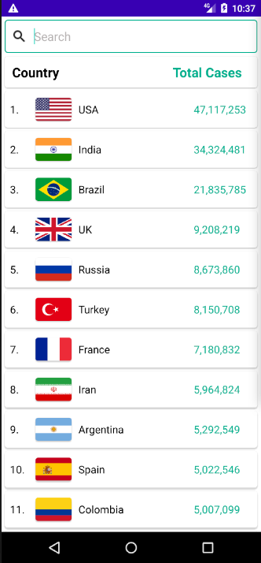
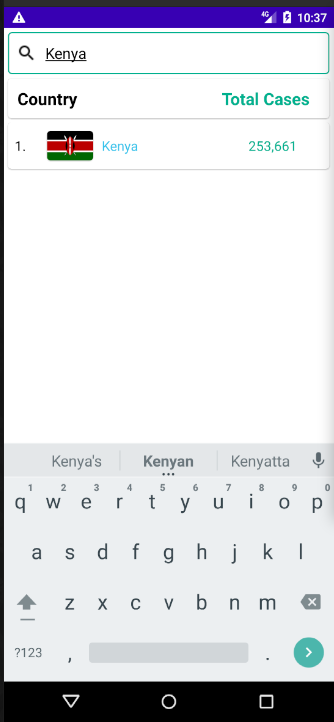
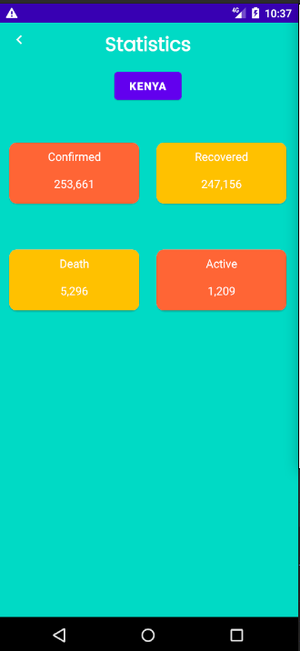

# COVID INFORMER
#### This is an app that tracks the statistics of covid-19 in all countries and return the number of Deaths, Recovery, Confirmed and Active cases.

## Demo






## Setup/Installation Requirements
* Fork/Clone the repository
```
   $ git clone https://github.com/allanlimo02/Covid-Informer
```
* Open your project on Android Studio.
* Run the project.

## Known Bugs
No known bugs
## Technologies Used
* Java
* Android
* Firebase

### License
This project is licensed under the [MIT LICENSE](https://github.com/andreassenmarvin/Covid-Informer/blob/master/LICENSE)
